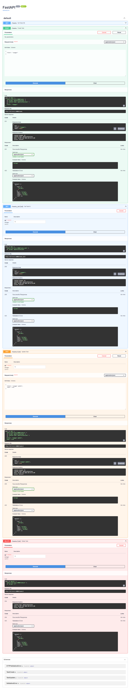
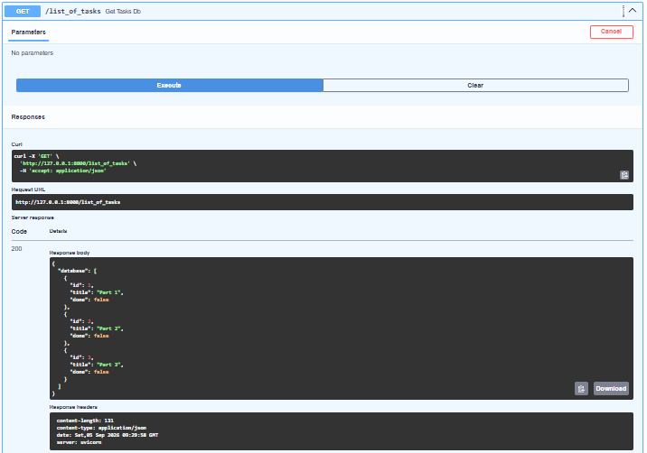

### Swagger UI Screenshot



 - **This endpoint fetches my tasks from main.py. It's elements are only a copy of the Prototype_tasks, for the purpose of demo and testing.

---

## Features

- **CRUD Operations**: Fetch all tasks or individual tasks by unique ID.
- **Filtering**: Filter tasks by completion status (`done`) and case-insensitive keyword search (`search`).
- **Metric Aggregations**: Real-time statistics on total, completed, and open tasks.
- **State Management**: On-demand database reset endpoint (`POST /reset`) for testing and demonstrations.

---

## API Endpoints

| Method | Endpoint                | Description                                    | Parameters                  |
| :---   | :---                    | :---                                           | :---                        |
| `GET`  |  `/tasks`               | Retrieve all tasks with defined 'done' status  | `done` (optional, bool)     |
| `GET`  |  `/list_of_tasks`       | Retrieve all tasks without constraints         | None                        |
| `GET`  |  `/tasks_status`        | Compute task metrics (`total`, `done`, `open`) | None                        |
| `GET`  |  `/tasks_search`| Retrieve all tasks containing the title string | `search` (optional, str)    |
| `GET`  | `/tasks/{id}`           | Get a single task by unique ID                 | `id` (int)                  |
| `POST` | `/tasks`                | Create new tasks                               | 'tasks_input': (TaskCreate) |
| `POST` | `/reset`                | Revert dataset to initial seed state           | None                        |
| `PUT` | `/tasks/{id}`                | Update an existing task using ID for reference |`id`: int, `task_update`: TaskUpdate|
| `DELETE` | `/tasks/{id}`                | Delete an existing task using ID for reference | `id`: int  |


---
## Verification

### curl -i Output

``` HTTP/1.1 200 OK
date: Tue, 08 Sep 2026 13:34:18 GMT
server: uvicorn
content-length: 31
content-type: application/json

{"total":3,"done":1,"open":2}

---